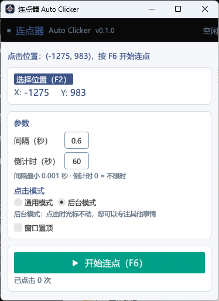
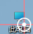
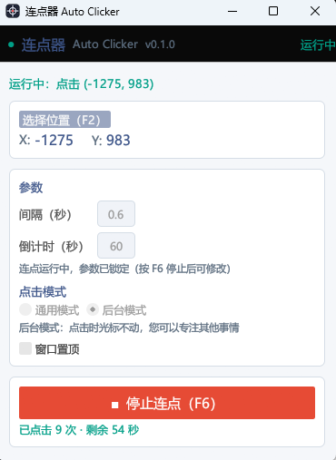

# Auto Clicker · 连点器

<p align="center">
  <a href="README.md">English</a> | <strong>简体中文</strong>
</p>

[](https://www.rust-lang.org)
[](https://github.com)
[](LICENSE)

轻量级 Windows 连点工具：在屏幕上选择任意位置，程序自动按设定频率连点。
支持**多显示器取点**、**倒计时自动停止**、**全局热键**、**后台点击（光标完全不动）**，
常驻系统托盘，单文件 exe，无任何运行时依赖。

| 主界面 | 全屏取点 | 连点中 |
|:---:|:---:|:---:|
|  |  |  |

## ✨ 功能亮点

- **全屏准星取点**（`F2`）：覆盖层铺满整个桌面，十字准星 + 3 倍实时放大镜，像素级精确选点；背景为屏幕实时快照，所见即所得
- **多显示器支持**：取点覆盖层横跨所有屏幕（副屏在主屏任意方向均可），坐标换算适配混合 DPI 缩放，不偏移
- **两种点击模式**：
  - **通用模式** —— SendInput 注入，所有软件可用，点击瞬间光标会跳到目标点
  - **后台模式** —— PostMessage 消息点击，**光标完全不动**，您可以继续用电脑做其他事情（适合浏览器等普通窗口）
- **精确间隔**：0.001 ~ 60 秒自由输入（默认 0.1 秒），纯数字输入框，不做拖动
- **结束控制**：倒计时自动停止（10 秒 ~ 10 小时，0 = 不限时），或随时 `F6` 手动启停
- **全局热键**：`F2` 取点 / `F6` 开始·停止，程序不在前台、甚至缩到托盘时依然生效
- **系统托盘**：常驻通知区域；左键单击显示窗口，右键菜单包含全部功能（开始·停止 / 取点 / 点击模式 / 间隔 / 时长 / 置顶 / 退出）；点窗口 ✕ 只是缩到托盘，连点不中断
- **单实例**：重复双击 exe 只会唤出正在运行的程序，不会开出一堆进程
- **运行中锁定参数**：连点进行时界面与托盘的参数修改自动置灰，防止误改无效配置
- **记忆上次配置**：坐标 / 间隔 / 时长 / 模式自动保存，下次启动原样恢复
- **窗口置顶**开关、实时显示已点击次数与剩余时间

## 🚀 快速开始

**方式一：直接下载**

到 [Releases](../../releases) 页面下载 `AutoClicker.exe`，双击即用，无需安装。

**方式二：源码编译**（需 [Rust](https://rustup.rs)）

```bash
cargo build --release
# 产物: target\release\AutoClicker.exe
```

## 📖 使用方法

1. 按 `F2`（或点“选择位置”）→ 移动鼠标到目标点 → **左键确认**（Esc 取消）
2. 输入点击间隔与倒计时
3. 按 `F6` 开始连点，再按 `F6` 停止

| 热键 | 作用 |
|---|---|
| `F2` | 打开全屏取点（运行中锁定） |
| `F6` | 开始 / 停止连点 |

> 💡 目标是浏览器等普通窗口时，切换到“后台模式”，连点期间光标完全不动，您可以继续做其他事情。

## 🖱️ 点击模式对比

| 模式 | 原理 | 光标 | 适用场景 |
|---|---|---|---|
| 通用模式（默认） | SendInput 注入 | 点击瞬间跳到目标点 | 所有软件，包括部分游戏 |
| 后台模式 | PostMessage 发消息 | **完全不动** | 浏览器等普通窗口 |

## ❓ 常见问题

- **SmartScreen 提示**：exe 未做代码签名，首次运行点“更多信息 → 仍要运行”即可，不影响使用。
- **快捷键失效**：F2 / F6 可能被其他程序占用，关闭占用程序后重启本程序。
- **后台模式点击无效**：目标程序不支持消息级点击，请换用通用模式。
- **副屏取不到点**：本程序原生支持多显示器；若仍异常，请确认系统缩放设置后重新取点。

## 🛠️ 开发

```bash
cargo run                 # 调试运行
cargo build --release     # 发布构建
python tools/gen_icon.py  # 重新生成图标（需 Pillow）
```

技术栈：[Rust](https://www.rust-lang.org) + [egui/eframe](https://github.com/emilk/egui) + WinAPI（SendInput / PostMessage / Shell_NotifyIcon / RegisterHotKey）。

## 🤝 参与贡献

欢迎任何形式的参与！

- 🐛 发现 Bug 或有功能建议 → [提一个 Issue](../../issues)
- 💡 有任何想法或使用疑问 → 欢迎在 Issue 里留言
- ⭐ 觉得好用就点个 Star，谢谢各位！

## 📄 License

[MIT](LICENSE)

## ⚠️ 使用声明

本工具仅供学习研究与合法自动化操作使用（如自动化测试、辅助操作等）。使用时请遵守目标软件的服务条款与相关法律法规，由此产生的一切后果与开发者无关。
